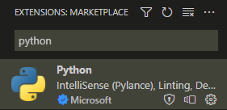

# Python 3 and IDE Setup

If you've already installed Python and an IDE, you can [proceed with "Getting Started"](getting-started.md).

## Installing Python

### Windows

If you haven't installed Python yet, [you can download the installer here](https://www.python.org/downloads/).

This project requires Python 3.9 or newer, so make sure you download the correct
one.

### Linux distributions

Install Python with the package manager of your distribution.

!!! info 
    If you get the error "No module named 'tkinter'", you have to install the
    Python package with tkinter included. For example, *python3-tk* for ubuntu.
    [Here is a relevant StackOverflow post.](https://stackoverflow.com/questions/25905540/importerror-no-module-named-tkinter)

## Installing an IDE of your choice

You can develop Python scripts using a simple text editor. However, using an IDE
is recommended because it makes developing a bit easier:

- You can use autocompletion for functions and variables
- You can debug more efficiently
- You get syntax and error highlighting

### Visual Studio Code

To use VS Code, follow these steps:

1. [Install VS Code](https://code.visualstudio.com/Download)
2. After launching: on the left side, click on the "Extension" tab
3. Search for "Python" in the upper search bar
4. Install the "Python" extension by Microsoft: 
   
5. Restart VS Code

After installing VS Code and the Python
extension, [proceed with "Getting Started"](getting-started.md).

### PyCharm

If you are a university student, you can apply for [GitHub Global Campus](https://education.github.com)
to get access to [free educational licences for JetBeans products](https://www.jetbrains.com/community/education/).
This licence must only be used for non-commercial educational purposed and can
be renewed as long as you are a student.

To install PyCharm, [download the installer here](https://www.jetbrains.com/pycharm/download/)
and follow the installation wizard.

After installing PyCharm, [proceed with "Getting Started"](getting-started.md).
