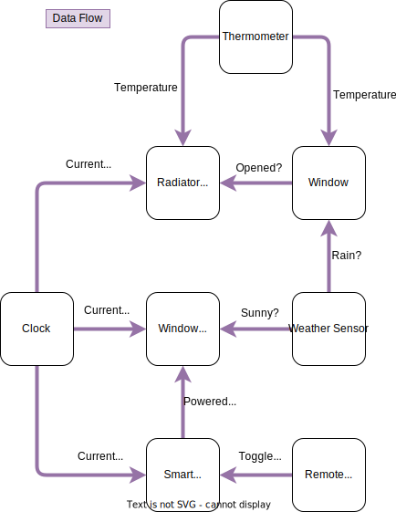

# Introduction

This virtual smart home scenario is a possible application of the MQTT protocol.
By using a MQTT broker, smart home devices can communicate and interact with
each other. Generally speaking, it works like this:

1. The sensor devices generate some kind of data, like current temperature,
button presses or the current time.
2. The actuator devices or other devices subscribe to the MQTT topics.
3. When the sensors publish new data, the actuators can act accordingly.

The configuration of the devices is done programmatically.

A more detailed description of the devices and used topics can be found
[here](devices.md).